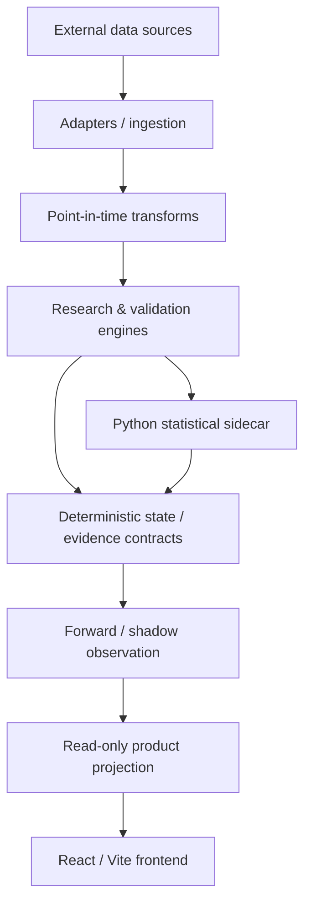

# QuanTerminal — Engineering Showcase

[](https://github.com/luh0pump/QuanTerminal-Showcase/actions)

Public, sanitized engineering showcase for **QuanTerminal**, a private quantitative research and validation platform.

This repository is intentionally **not a synchronized mirror of the production codebase**. It exposes representative engineering patterns, tests and documentation while excluding live strategy logic, signals, proprietary research state, paid datasets and account/broker information.

## What this demonstrates

- C#/.NET system decomposition
- Python statistical tooling
- adapter-based data integration
- point-in-time data discipline
- deterministic validation gates
- reproducible research workflows
- automated tests and CI
- explicit separation between research, forward/shadow evidence and product-facing state
- AI-assisted implementation with independent verification

## Current production architecture — sanitized view



The private production system has evolved materially since the first public showcase snapshot. Today the core remains C#/.NET with Python statistical tooling, while the read-only frontend is React/Vite and the operating model places much more emphasis on machine-readable state, explicit evidence contracts and reproducible review gates.

## Engineering principles

### 1. Point-in-time correctness
Historical data is processed using only information available at the relevant observation time. Transform and alignment rules are designed to prevent look-ahead leakage structurally rather than relying on analyst discipline alone.

See: [Point-in-time notes](docs/point-in-time.md)

### 2. Validation is a gate
Research outputs do not become trusted simply because a backtest looks good. Validation is treated as an explicit gate, including statistical checks, out-of-sample evidence and reproducibility requirements.

See: [Validation methodology](docs/validation-methodology.md)

### 3. Evidence over claims
Important transitions are backed by tests, reproducible artifacts and explicit state. This is especially important in long-running AI-assisted engineering workflows where implementation and independent review are deliberately separated.

### 4. Public proof without exposing IP
The public repository shows real engineering structure and tests, but deliberately omits:

- strategy definitions and signals
- private research registers
- proprietary datasets
- broker/account information
- production credentials and private endpoints
- current operational state files

## Public repository structure

```text
src/                      representative C# implementation
python/                   representative Python statistical tooling
tests/                    automated tests
docs/                     methodology and architecture notes
.github/workflows/        CI
```

## Technology

| Area | Technology |
|---|---|
| Core engineering | C# / .NET |
| Statistical tooling | Python |
| Data / research storage | DuckDB / Parquet patterns |
| Product UI in current private system | React / Vite |
| Validation | C# + Python |
| Delivery | Git + GitHub Actions |
| Operating model | deterministic contracts, tests, evidence and independent review |

## Run the public tests

```bash
dotnet test
cd python
pytest
```

## Portfolio context

QuanTerminal is the strongest proof of my work on larger, ambiguous engineering problems: turning research requirements into explicit interfaces, validation rules, tests and reproducible state instead of one-off scripts.

For a compact Python + LLM automation example, see:

- [AI Company Evaluation Pipeline](https://github.com/luh0pump/ai-company-evaluation-pipeline)

More context: [Portfolio overview](docs/portfolio-overview.md)

---

Built by [@luh0pump](https://github.com/luh0pump).
